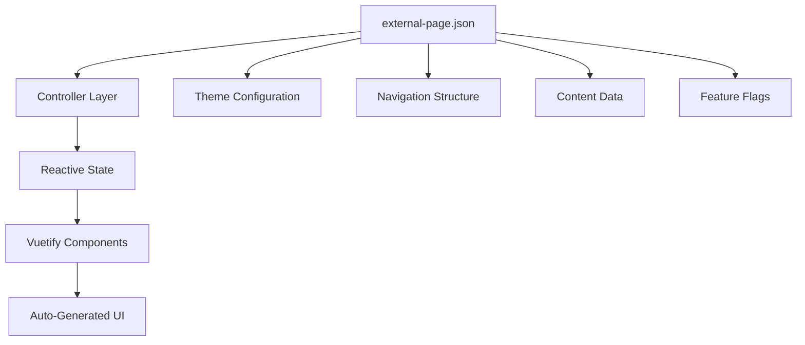

# �️ LCO Centralized Membership and Clearance Tracking System

<div align="center">


### 🎯 **Centralized Platform for Managing Student Clearance and Compliance**

*A centralized platform for managing, blocking, and unblocking students' clearance status within the university. Ensure compliance and streamline clearance workflows for all students record.*

[](https://codespaces.new/centmarde/LCO-Centralized-membership-and-Clearance-Tracking-System?quickstart=1)
[](https://vercel.com/new/clone?repository-url=https://github.com/centmarde/LCO-Centralized-membership-and-Clearance-Tracking-System)

</div>

---

## ✨ **What Makes This Special?**

This is a **data-driven, configuration-first** Vue 3 application designed for the LCO (Local Campus Organization) clearance management system. The platform enables efficient tracking and management of student clearance status, providing tools for blocking/unblocking students based on compliance requirements. Instead of manually coding components and layouts, you simply update `external-page.json` and watch your application transform automatically.

### 🎨 **Key Features: LCO Clearance Management**

🛡️ **Student Blocking** - Easily block or unblock students based on compliance, violations, or clearance requirements.

🏢 **Centralized Management** - View and manage all students' clearance status in one place.

📋 **Audit Trail** - Track all blocking and unblocking actions for transparency and accountability.

👥 **Role-Based Access** - Admins, officers, and organization representatives have tailored access and permissions.

### 🎨 **JSON-Driven Configuration**
```json
{
  "title": "LCO Clearance Blocking System",
  "features": [
    {
      "title": "Student Blocking",
      "description": "Easily block or unblock students based on compliance",
      "icon": "mdi-block-helper"
    }
  ],
  "theme": { "primaryColor": "#96A78D" }
}
```

---

## 🛠️ **Tech Stack & Architecture**

<table>
<tr>
<td width="50%">

### **Frontend Core**
- **🖼️ Vue 3** - Composition API with `<script setup>`
- **🎨 Vuetify 3** - Material Design components **(Styling-Only)**
- **📘 TypeScript** - Full type safety with strict config
- **⚡ Vite** - Lightning-fast dev server & builds
- **🍍 Pinia** - Intuitive state management

</td>
<td width="50%">

### **Backend & Services**
- **🚀 Supabase** - Authentication & Database
- **🌐 Axios** - HTTP client for data fetching
- **🔄 Vue Router 4** - File-based auto-routing
- **🎭 Vue Toastification** - Elegant notifications
- **📋 Auto-imports** - Zero-import development

</td>
</tr>
</table>

### **🤖 Zero-Config Automation**
| Plugin | Purpose | Auto-Generated |
|--------|---------|----------------|
| `unplugin-vue-router` | 📁 **File-based routing** | Routes from `src/pages/*.vue` |
| `unplugin-vue-components` | 🔧 **Auto-importing** | Global components from `src/components/` |
| `vite-plugin-vue-layouts-next` | 📐 **Layout system** | Layout wrappers from `src/layouts/` |
| `unplugin-auto-import` | ⚡ **Composables** | Vue/Pinia/Router APIs without imports |
| `unplugin-fonts` | 🔤 **Typography** | Google Fonts auto-loading |

---

## 🏗️ **Data-Driven Architecture**

### **Single Source of Truth: `external-page.json`**


### **Controller Pattern**
```typescript
// src/controller/landingController.ts
export function useLandingController() {
  const data = ref<LandingData | null>(null)
  const loading = ref(false)
  const error = ref<string | null>(null)
  
  const fetchLandingData = async () => {
    const response = await axios.get<LandingData>('/data/external-page.json')
    data.value = response.data
  }
  
  return { data, loading, error, fetchLandingData }
}
```

---

## 🚀 **Quick Start**

### **Prerequisites**
- Node.js 18+ 
- npm/yarn/pnpm

### **Installation**
```bash
# Clone the repository
git clone https://github.com/centmarde/LCO-Centralized-membership-and-Clearance-Tracking-System.git
cd LCO-Centralized-membership-and-Clearance-Tracking-System

# Install dependencies
npm install

# Start development server
npm run dev
```

### **Customize Your App**
1. **📝 Edit Configuration**: Modify `public/data/external-page.json`
2. **🎨 Adjust Theme**: Update theme colors in the JSON
3. **📄 Add Pages**: Create `.vue` files in `src/pages/` (auto-routed)
4. **🧩 Add Components**: Drop components in `src/components/` (auto-imported)

---

## 📁 **Project Structure**

```
src/
├── 📱 components/
│   ├── auth/           # Authentication components
│   ├── common/         # Shared UI components
│   └── [feature]/      # Feature-specific components
├── 🎛️ controller/      # Data fetching & state management
├── 📄 pages/           # Auto-routed page components
├── 🗃️ stores/          # Pinia state stores
├── 🎨 layouts/         # Layout wrapper components
├── 🔧 plugins/         # Vue plugin configurations
└── 📚 lib/             # Utility libraries & services

public/
└── 📊 data/
    └── external-page.json  # 🎯 Main configuration file
```

---

## 💡 **Core Philosophy**

### **🎯 Configuration Over Code**
- **Data-Driven**: UI derives from JSON configuration
- **Zero Manual Wiring**: Components auto-connect to data
- **Rapid Prototyping**: Change JSON, see instant results

### **🎨 Vuetify-First Styling**
- **Component-Based**: No custom CSS classes
- **Design System**: Consistent Material Design
- **Responsive**: Built-in breakpoint handling

### **🔄 MCP-Enhanced Development**
- **Vuetify MCP**: Component API documentation
- **Context7**: External library references  
- **Sequential Thinking**: Complex problem solving
- **Playwright**: Automated UI testing

---

## 👥 **Meet the LCO System Team**

The LCO Centralized Membership and Clearance Tracking System is developed and maintained by a dedicated team of professionals committed to streamlining clearance management and ensuring organizational compliance.

<div align="center">

### **Core Development Team**

</div>

<table align="center">
<tr>
<td align="center" width="200">
  
  <br />
  <sub><b>Dimple B. Parba</b></sub>
  <br />
  <sub>🚀 Lead Developer</sub>
  <br />
  <sub><i>Full-stack development, system architecture, and technical leadership</i></sub>
</td>
<td align="center" width="200">
  
  <br />
  <sub><b>Edrian Tacmoy</b></sub>
  <br />
  <sub>📋 Compliance Officer</sub>
  <br />
  <sub><i>Clearance policy implementation, compliance workflows, and system requirements</i></sub>
</td>
<td align="center" width="200">
  
  <br />
  <sub><b>Janah Mae Layno Navallo</b></sub>
  <br />
  <sub>🎨 UI/UX Designer</sub>
  <br />
  <sub><i>User interface design, user experience optimization, and accessibility</i></sub>
</td>
</tr>
</table>

<div align="center">

*"Compliance is the foundation of trust in every organization."* - LCO Admin Team

**🎯 Our Mission:** To provide a transparent, efficient, and user-friendly platform for managing student clearance and organizational compliance across all university departments.

</div>

---

## 🤝 **Contributing & Recommendations**

We welcome contributions and recommendations! The LCO Clearance System is designed to:

- **�️ Streamline clearance management** for students and organizations
- **📋 Ensure compliance** with university policies and procedures
- **🔧 Provide audit trails** for transparency and accountability
- **� Support role-based access** for different user types
- **📱 Enable cross-platform** deployment (Web, PWA, Mobile)
- **📈 Scale efficiently** with modern Vue 3 patterns

### **Contribution Areas**
- 🛡️ **Clearance Workflows**: Enhanced blocking/unblocking processes
- 📋 **Compliance Features**: New audit and reporting capabilities
- 🎨 **UI Components**: Improved Vuetify component patterns
- 📊 **Data Management**: Enhanced clearance tracking schemas
- 🔌 **Integrations**: University system integrations
- 📱 **Platform Support**: Mobile/desktop optimizations
- 📚 **Documentation**: Usage guides and admin tutorials

---

## 📄 **License**

This project is open source and available under the [MIT License](LICENSE).

---

<div align="center">

**🌟 Star this repo if it helps improve your organization's clearance management!**

[🐛 Report Bug](https://github.com/centmarde/LCO-Centralized-membership-and-Clearance-Tracking-System/issues) • [💡 Request Feature](https://github.com/centmarde/LCO-Centralized-membership-and-Clearance-Tracking-System/issues) • [💬 Discussions](https://github.com/centmarde/LCO-Centralized-membership-and-Clearance-Tracking-System/discussions)

</div>